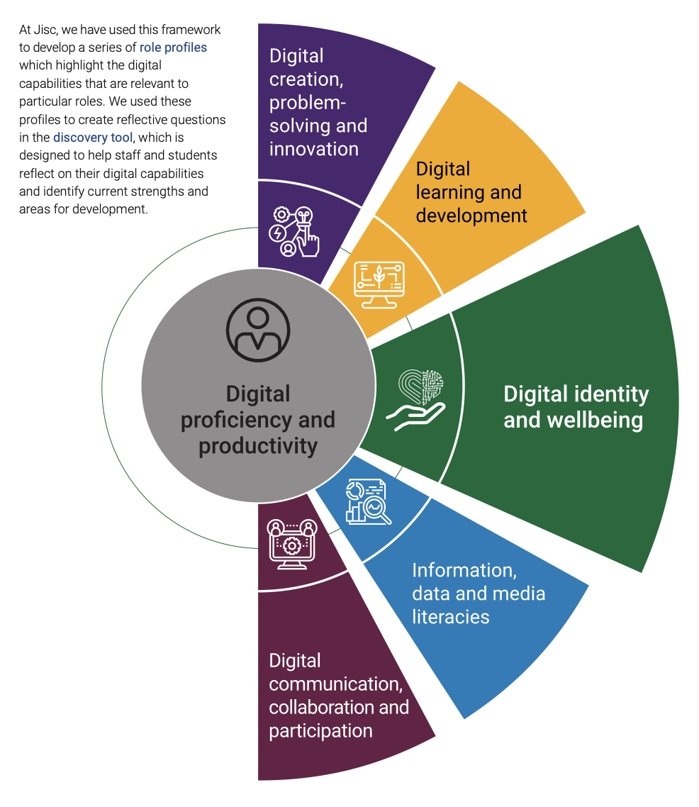
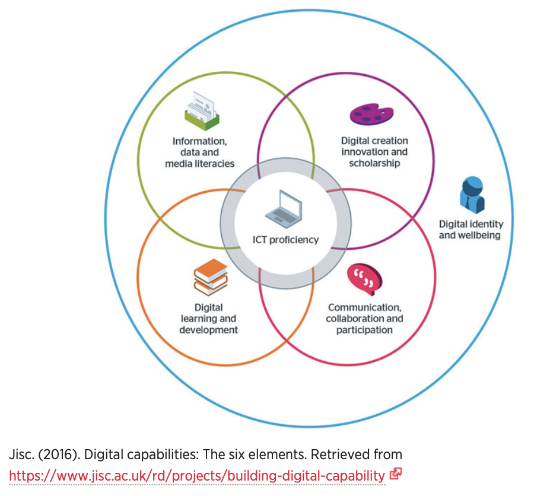
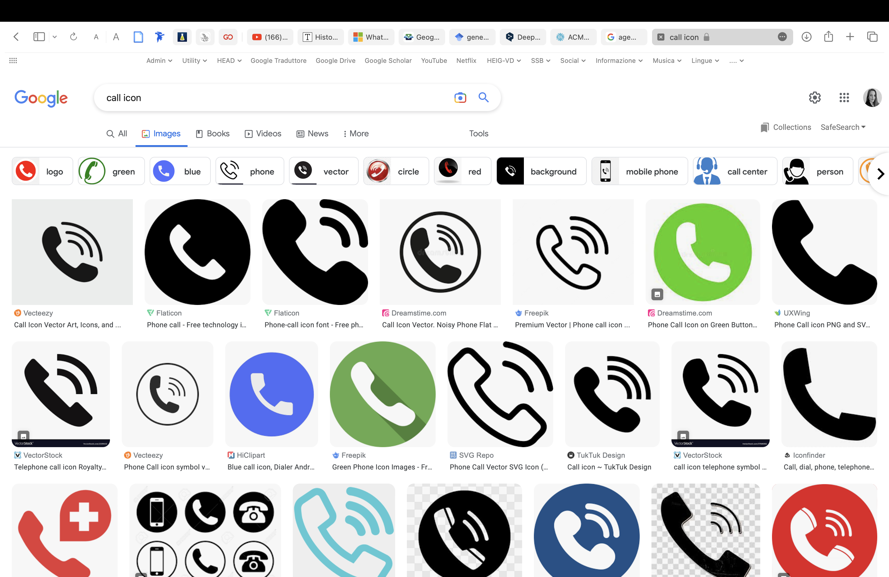
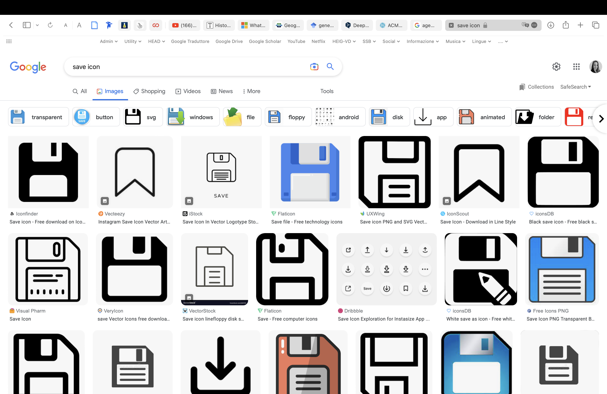
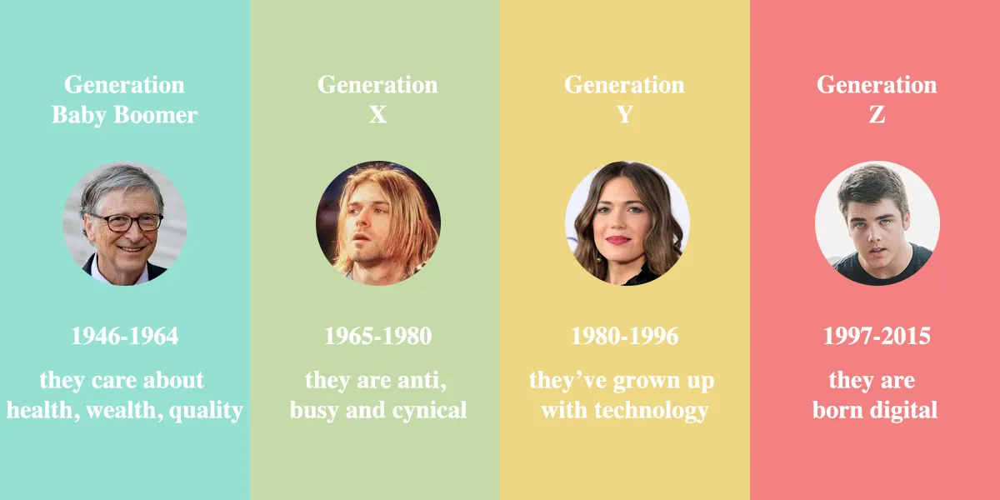
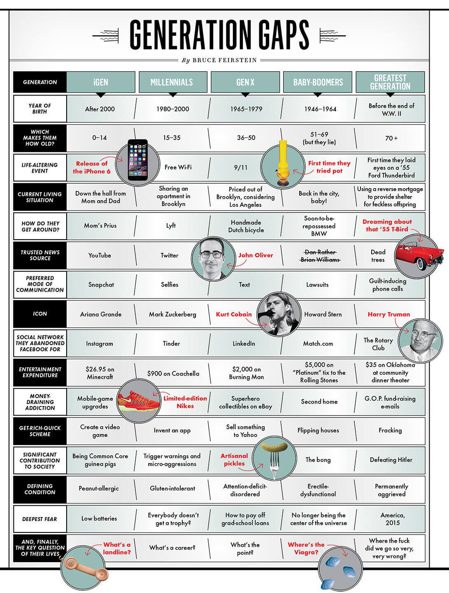
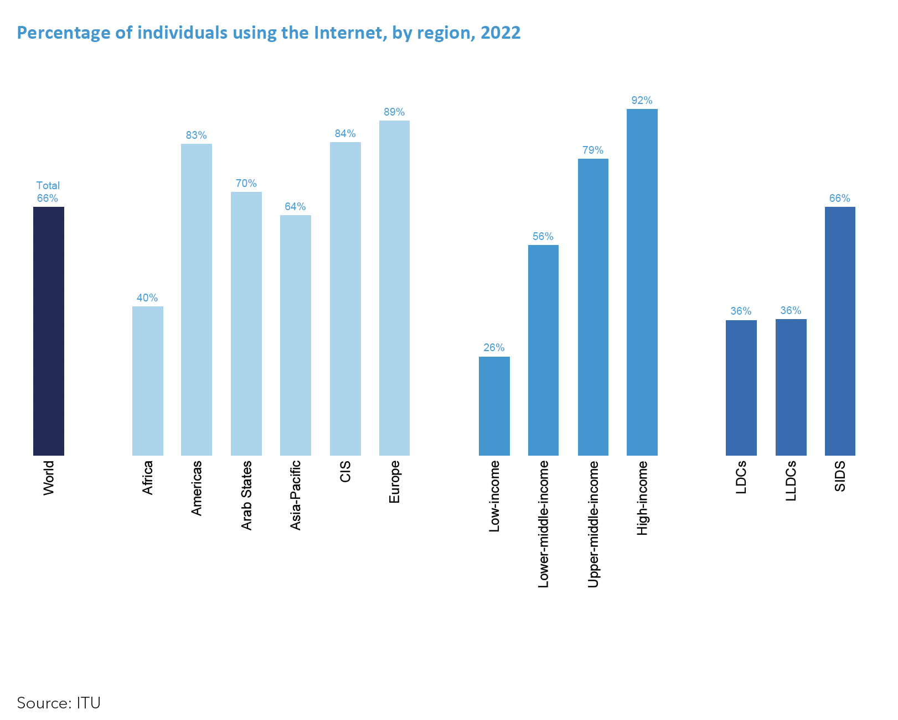

# INSPIRATION

Here: upload (1) a .md file with a list of terms/topics and their definition and 3 potential research questions, (2) at least 10 academic resources (articles, book chapters) about your topics, (3) visuals about what you are interested in.

## List of terms and topics

1. digital natives (DNs) vs. digital immigrants (DIs) 
   "“Digital native” is a term for people born in the digital era, i.e., Generation X and younger. This group is also referred to as the “iGeneration” or is described as having been born with “digital DNA.” In contrast, the term “digital immigrant” refers to those born before about 1964 and who grew up in a pre-computer world. The terms “digital immigrants” and “digital natives” were popularized and elaborated upon by Dr. Mark Prensky (2001) and critiqued for their validity and usefulness by Harding (2010) among others. In the most general terms, digital natives speak and breathe the language of computers and the culture of the web into which they were born, while digital immigrants will never deal with technology as naturally as those who grew up with it." 
   (https://www.zurinstitute.com/resources/digital-divide/)  

2. digital divide / Digital inequality  
   geographical delay on accessibility of technology and inequalities,
   "The digital divide is a term that refers to the gap between demographics and regions that have access to modern information and communications technology (ICT), and those that don't or have restricted access. This technology can include the telephone, television, personal computers and internet connectivity." 
   (https://www.techtarget.com/whatis/definition/digital-divide)  

3. type of icons  

   - Universal icons (A few icons enjoy nearly universal recognition among users. The symbols for home, printing, searching and the shopping cart are such icons. There is only one problem: Universal icons are rare. Beyond the examples cited above, most icons are ambiguous. They can have different meanings depending on the interface.) 
   - Icons with conflicting meanings (Trouble comes when you implement a commonly used pictogram that has contradictory meanings. The heart and the star are excellent examples. Not only does the functionality associated with these icons vary from app to app, but these two icons compete with each other.)  
   - Unique icons (Icons are especially bad for anything abstract because they generally are not strong visual representations. How do you describe a unique object or action? Apple’s icon for its Game Center app, for example, is a group of colorful circles. What does the Game Center icon mean? How does it relate to gaming?)  
     (https://www.smashingmagazine.com/2016/10/icons-as-part-of-a-great-user-experience/)  

4. digital transformation  
   "Digital transformation can refer to anything from IT modernization (for example, cloud computing), to digital optimization, to the invention of new digital business models. The term is widely used in public-sector organizations to refer to modest initiatives such as putting services online or legacy modernization. Thus, the term is more like “digitization” than “digital business transformation.”"  
   (https://www.gartner.com/en/information-technology/glossary/digital-transformation)  

5. digital literacy levels  
   "Digital literacy means having the skills you need to live, learn, and work in a society where communication and access to information is increasingly through digital technologies like internet platforms, social media, and mobile devices." 
   (https://www.westernsydney.edu.au/studysmart/home/study_skills_guides/digital_literacy/what_is_digital_literacy)
    

6. ICT proficiency  
   "The use of ICT-based devices, applications, software and services.
   The confident adoption of new devices, applications, software and services and the capacity to stay up to date with ICT as it evolves. The capacity to deal with problems and failures of ICT when they occur, and to design and implement ICT solutions. An understanding of basic concepts in computing, coding, and information processing."  
   (https://repository.jisc.ac.uk/6611/1/JFL0066F_DIGIGAP_MOD_IND_FRAME.PDF)  

7. individual digital capabilities  
   "What it means to be digitally capable will vary for each person. It will depend on the requirements of their role, their subject specialism, career choice, personal and other contextual factors. Our Digital capabilities framework looks more closely at what this means for individuals. The six elements of this framework are:  

- Digital proficiency and productivity (functional skills)  
- Information, data and media literacies (critical use)  
- Digital creation, problem solving and innovation (creative production)  
- Digital communication, collaboration and participation (participation)  
- Digital learning and development (development)  
- Digital identity and wellbeing (self-actualising)"  
  (https://digitalcapability.jisc.ac.uk/what-is-digital-capability/individual-digital-capabilities/)  

## Potential research questions

1. Are digital immigrants influencing (negatively) technology progress on information and communications technology (ICT) preficiency?
2. Exploring the impact of the digital divide on the access to information and opportunities for digital natives and digital immigrants.
3. How firsts GUI have influenced modern iconography and

## Academic resources

- https://sam.ensam.eu/handle/10985/23101
- https://www.mdpi.com/2071-1050/14/10/6067
- https://www.learntechlib.org/p/141683/
- https://www.stirworld.com/think-columns-digital-legacies-generation-gap
- https://us.norton.com/blog/how-to/digital-generations#
- https://journals.sagepub.com/doi/abs/10.1177/1461444814554902?journalCode=nmsa
- https://www.sciencedirect.com/science/article/abs/pii/S0378720619305117
- https://link.springer.com/chapter/10.1007/978-3-662-46590-5_2
- https://bera-journals.onlinelibrary.wiley.com/doi/abs/10.1080/01411920902989227
- https://learn.microsoft.com/en-us/windows/mixed-reality/discover/mixed-realit
- https://think.design/blog/labyrinth-through-a-history-of-digital-iconography-from-1980s-to-2010s-part-4/
- https://www.itu.int/en/mediacentre/Pages/PR-2023-03-05-facts-and-figures-focus-on-least-developed-countries.aspx-

## Visuals

