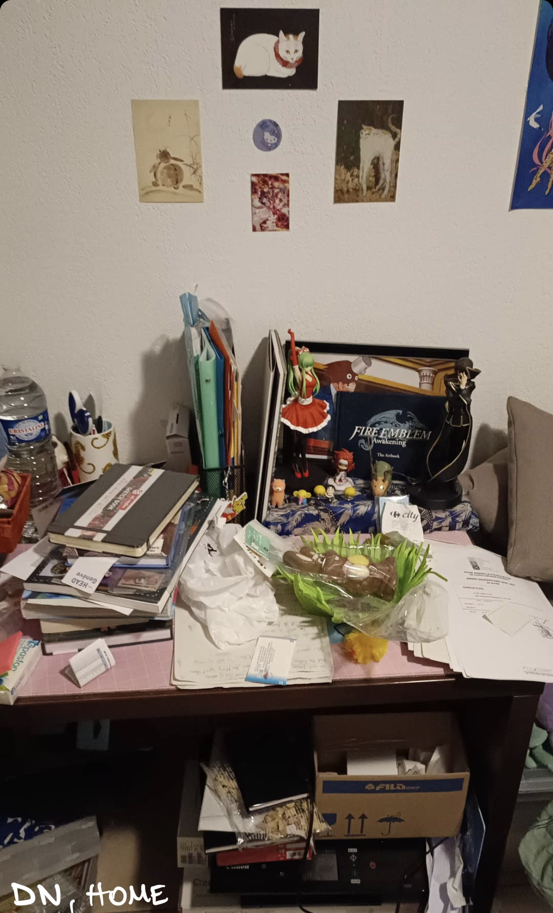

# Quantitative data sampling

## Goal description

The goal in this study is to undestande how people organise the work desk, if the computer is main part of it.

## Sampling

WHO: DI and DN, different jobs and degrees
WHEN: 29 may-31 may
WHERE: Vaud/Ticino

## Questions

Can you send me a picture of your home/work desk?

## Answers

## Analysis
