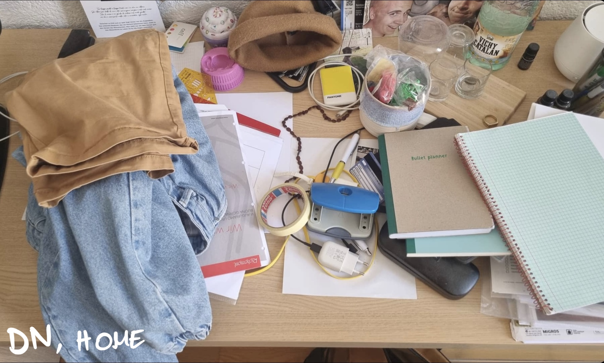

# Quantitative data sampling

## Goal description

The goal of this study is to undestand how people organise the work desk, if the computer is main part of it.

## Sampling

WHO: DI and DN, different jobs and degrees
WHEN: 29 may-31 may
WHERE: Vaud/Ticino

## Questions

Can you send me a picture of your home/work desk?

## Answers

## Analysis

Given a proximity to people coming from a technical background, many desks in this study belong to people who are above average in terms of technological knowledge.
It is therefore normal to have fairly advanced Setups, especially in the case of homeworking in a corporate sector.

it is interesting to see how sometimes some DNs, despite being born in the digital age and having grown up with basic computer knowledge anyway, do not consider the computer as the center of their work area. It may also be due to the type of occupation they have, but it is not always a central factor. A nurse put the computer as focus point, a student did not even frame it.

Interesting to see the stark contrast of my grandmother's desk (who does not own a computer and prefers to do everything by hand, on her desk only card processing tools), with her son's (full of audio equipment and electronic devices of all kinds but not a scissors)

However, my grandmother, in order to keep up with payments, bureaucracy, or even to be able to take advantage of the supermarket's benefits, needs to write down my dad's e-mail and go through his device.
So although she does not have a computer, through her son she can take advantage of the same technology and be considered as 'digitised'.

## To go further

necessary position: study on the adaptation of DI OR how a pre-DI influenced the next generation.
