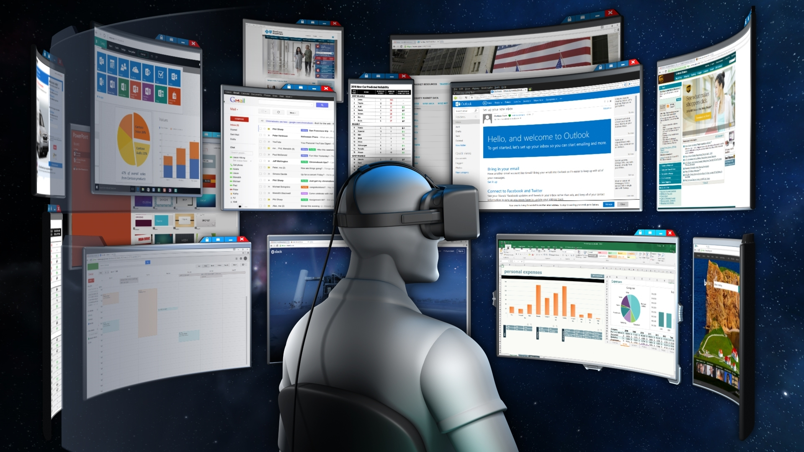
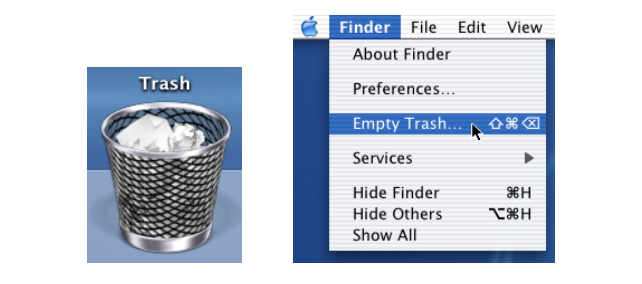
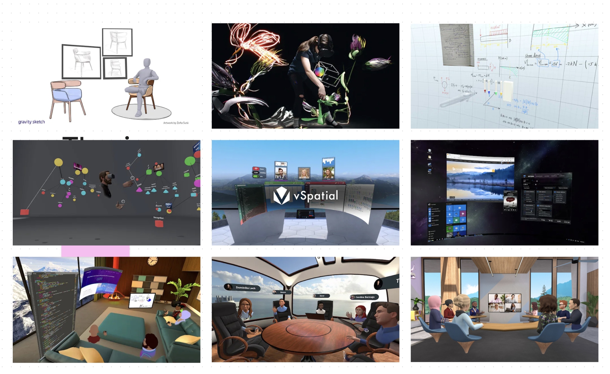
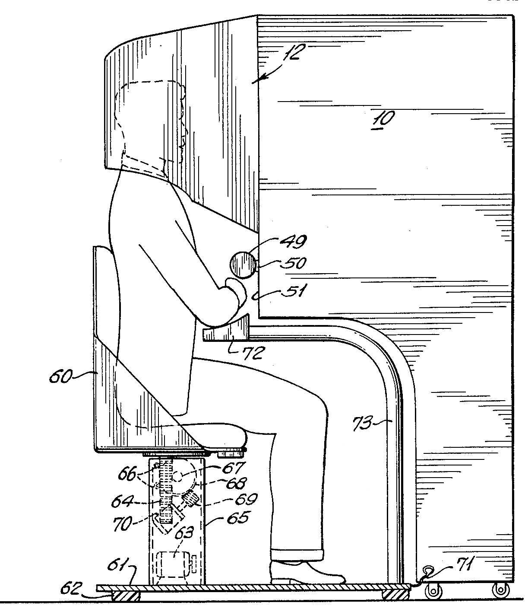
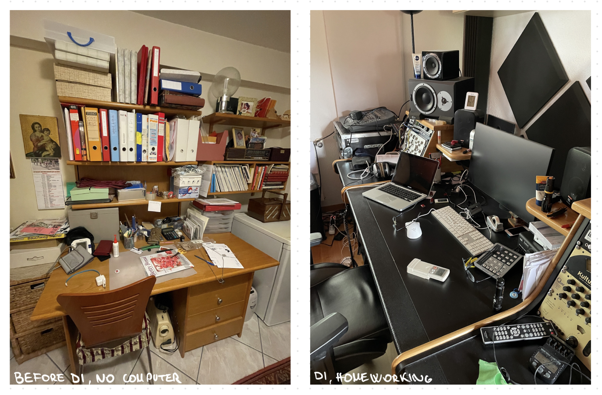

# Presentation 01.06.2023

## Research questions

- How digital immigrants are influencing VR UIs?
- How the desktop (workspace) is evolving, are people's habits also changing?
- Would VR be our future workspace?

        Envelop VR

## References

1. User-Interface Metaphors in Theory and Practice - Pippin Barr
   

2. https://www.tandfonline.com/doi/epdf/10.1080/00140139.2020.1869320?needAccess=true&role=button

3. https://inria.hal.science/inria-00533595/file/UIST06-facades-av.pdf

4. https://www.zippia.com/advice/virtual-reality-statistics/#:~:text=Virtual%20Reality%20Statistics%20by%20Users,of%20VR%2FAR%20device%20users.

5. https://historyoficons.com

## Method

### 1. Research

VR Working application

- Horizon Workrooms
- MeetinVR
- Immersed
- Vr desktop
- vSpatial
- Noda
- Dry Erase: Infinite VR Whiteboard
- Tilt Brush
- Gravity Sketch
- Envelop VR

VR history
https://vrx.vr-expert.com/the-timeline-of-virtual-reality/

Concepts to go further
Bumtop, Paper paradigm,

### 2. Interviews - Computer histories

Sampling:

- WHO: 2 DI and 2 DN, different jobs and degrees
- WHEN: 20 may-31 may
- WHERE: Vaud/Ticino/Italy

Questions:

1.  Are you a computer owner? / There is a computer in your house?
2.  When and on which device was your first approach to a computer? How old were you? How do you feel?
3.  Was it your initiative in your private life or due to a need at your school/work? Were you helped by someone/lessons?
4.  Was it hard to understand how it works?
5.  Do you think it helped in your daily tasks?
6.  There is a physical action in your life that it's now totally replaced with a digital option?
7.  What is your daily consumption of computers now? (Is it part of your life? What do you use it for? You ask someone to do it for you?)
8.  Do you have a special relationship/story with your actual device? How did you choose/buy it?
9.  What's for you the problem with your computer? Are you able to troubleshoot?
10. How do you feel about new technologies?
11. Choice of next device (are there any expectations on the machine?)

Analysis of answers:

- In both DI and DN, one has more expertise in technology than the other interviewee in the same category.
- In all four cases, they said they are afraid of being left behind by the advancement of technology.
- In Persons 1 and 3, they are designed to not understand how certain things work, while others still hope to have the basic knowledge to be able to follow future social digitization.
- DI are resigned also because of their age, they know that "is normal" not understand how certain things work. In certain DN, instead, a sort of shame compared to peers who understand more.
- optimisation is the key, to how technology has optimized processes but at the expense of the human side.

### 3. Observation - Desk comparison

## Results - what I've learned

- All VR applications are showing the 2D in the 3D.
- The computer is not the focus of every person's desk (depending on personal work environment).
- resignation to the advancement of technology (positive and negative)
- Fear of being left behind
- having a computer in your home is key, public trials are harder.

## To go further - What's next?

- understand the physical implication of a VR desktop (necessities, problems, ...)
- focus group with DN AND DI
- interview with UI experts

## Feedback

- faire une analyse d'images des bureau, éléments recurrents
- discussion plujs larges
- peut être garder la Vr juste ocmme point de reflexion futur, pas forcement cmme point principale. Mieux se concentrer sur la difference d'approach enfre DI et DN, faire des tranches d'ages, de categories plus subtiles.
