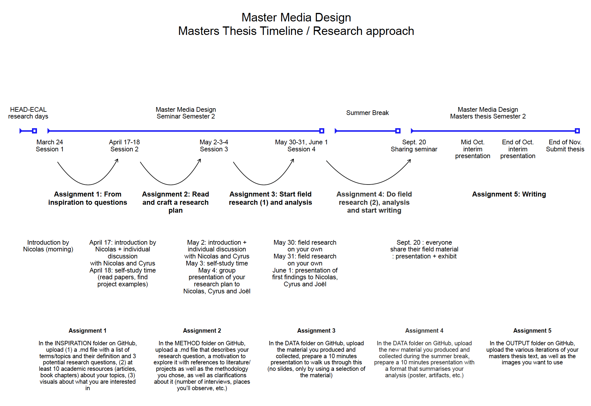

## Description

This Github folder will help document the research for my master thesis in Media Design @HEAD-Genève.
Every feedback, ideas, and images will be included too, in order to centralize the information.
For an easier usage, an additional "Zotero" library will be keeped externally.

## Official Planning

## Feedback and meetings notes

- **March 24**
  Discussed about main topic "Cultural background/Generational gap and digital interfaces comprehension".  
  --> _"Good point of start, base for discover other detailed researches"_

- **April 17/18**
